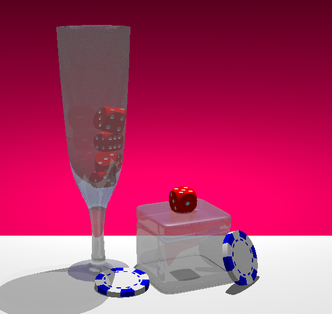

# Carlos III Grado de Ingenieria Informática
## Informatica grafica
Practica 1: Modelado de formas simples

Lenguaje: Povray
IDE: Visual Studio Code
Sistema operativo: Ubuntu 20.04.3 LTS

### Objetivo de la práctica
El objetivo de esta actividad es modelar los objetos que se muestran en la siguiente imagen, utilizando povray.


### Funcionamiento del programa
1. Descargar el repo <br/>
```git clone https://github.com/tiantianana/IG_p1```
2. cd al directorio raiz. <br/>
```
cd IG_p1
povray p1.pov +W560 +H529
```
### Resultado

